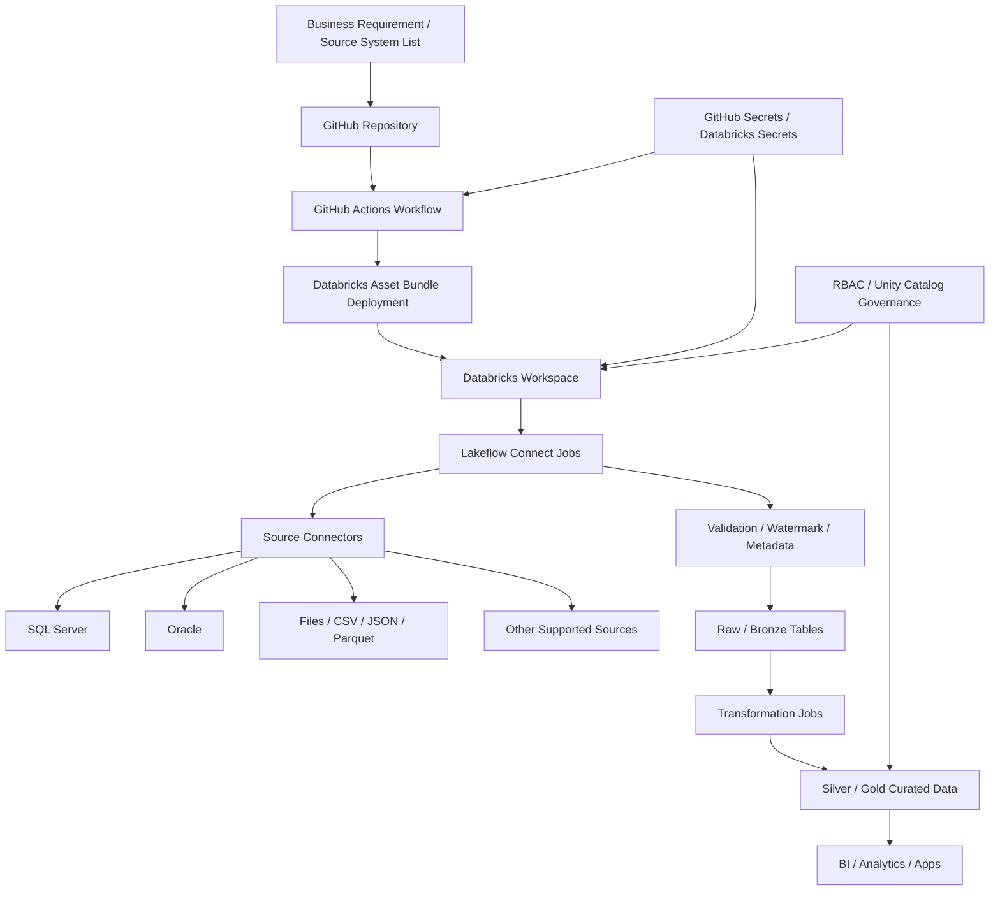

# Ingestion Framework Flow Documentation

## Purpose

This document explains the end-to-end flow of a Databricks ingestion framework built with:
- Lakeflow Connect
- Databricks Asset Bundles (DAB)
- GitHub Actions
- Databricks workspace and Unity Catalog

## Architecture summary

## Detailed flow

### 1. Define source systems
The first step is to decide which datasets are needed. Common examples in this POC are:
- SQL Server tables
- Oracle tables
- flat files in a landing directory
- file-based data in object storage

### 2. Store configuration in GitHub
All source definitions, job metadata, and pipeline settings are version-controlled in GitHub.

This keeps the solution:
- reviewable
- traceable
- repeatable
- easy to test across branches

### 3. GitHub Actions validates and deploys
A GitHub Actions workflow can:
- check code quality
- run tests
- authenticate to Databricks
- trigger a DAB deployment
- execute jobs or validation steps

This is the deployment bridge between development and Databricks.

### 4. DAB packages the Databricks assets
Databricks Asset Bundles package the resources required to run the pipeline.

This typically includes:
- notebooks or Python scripts
- scheduler/job config
- cluster settings
- environment variables
- dependency references

### 5. Databricks workspace receives the deployment
The bundle is deployed into the Databricks workspace, enabling the environment to manage execution.

This is where the jobs become operational and ready to run.

### 6. Lakeflow Connect starts ingestion
The connector layer reads data from each data source using the appropriate protocol:
- JDBC for SQL Server and Oracle
- file readers for CSV / JSON / Parquet
- object storage readers for cloud landing data

The connector handles the extract layer and typically performs file or table-level extraction with validation.

### 7. Data validation and checkpointing
Before raw data is persisted, the framework should:
- validate schema and row quality
- monitor duplicates and nulls
- apply incremental logic using watermarks or timestamps
- track ingestion metadata

This protects downstream processes and gives traceability.

### 8. Raw / bronze data landing
Validated data lands in a bronze/raw layer.

This stage keeps the original structure and preserves provenance for auditing and reprocessing.

### 9. Transformations build the curated model
After raw ingestion, transformation jobs standardize the data and create the silver layer.

Typical transformations:
- rename columns
- type conversion
- standardization
- deduplication
- merges into final business tables

### 10. Curated data is published
The final layer is exposed for analytics and business consumption.

This may include:
- dashboard datasets
- curated tables in Unity Catalog
- API outputs
- ML feature sets

## Simple business interpretation

If we describe it in business terms:

1. A source system produces data
2. GitHub stores the pipeline definition
3. GitHub Actions deploys the workflow
4. DAB deploys the jobs to Databricks
5. Lakeflow Connect extracts the data
6. Data is validated and landed in raw storage
7. Transformation jobs clean and standardize it
8. The final data is made available for reporting and business use

## Typical source matrix for the POC

| Source | Connector Type | Typical Use |
|---|---|---|
| SQL Server | JDBC | Operational relational data |
| Oracle | JDBC | Enterprise application data |
| CSV / JSON / Parquet | File ingestion | External feeds and landing files |
| ADLS / S3 | Storage connector | Raw object store integration |

## Operational recommendations

- Use secrets for all source credentials
- Keep environment settings separate for dev / test / prod
- Track ingestion metadata for recoverability
- Use incremental loads instead of full reloads when possible
- Add alerting for failed jobs and source availability

## Final takeaway

The end-to-end framework is not just a set of connectors; it is a controlled data movement lifecycle spanning source integration, deployment automation, validation, transformation, and consumable analytics output.

This design is ideal for a POC because it is easy to explain, easy to extend, and easy to operationalize.
