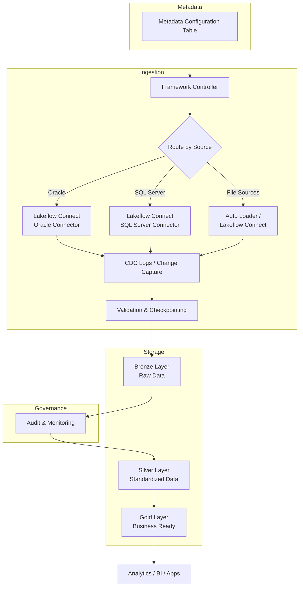
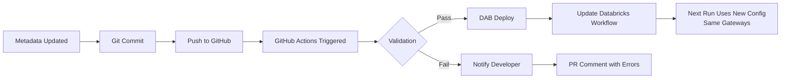
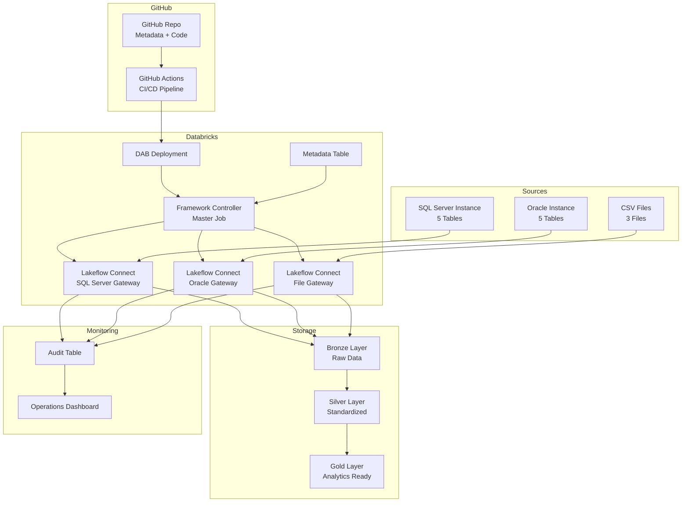

# Metadata-Driven Ingestion Architecture for Enterprise Scale

## The Problem: Traditional Approach (Doesn't Scale)

### Scenario: Enterprise Data Integration

Imagine an enterprise environment with:
- **20 source systems**
- **500 tables**
- **Daily loads**

### Traditional Approach

A developer creates one script per table:

```
customer_ingest.py
account_ingest.py
transaction_ingest.py
merchant_ingest.py
...
(500 scripts total)
```

### Problems with This Approach

| Problem | Impact |
|---------|--------|
| **High Maintenance Burden** | Every script is individually updated and tested |
| **Inconsistent Logic** | Different error handling, retry logic, logging across scripts |
| **Difficult Monitoring** | Need to monitor 500 separate jobs |
| **Slow Onboarding** | New table = new code + testing + deployment cycle |
| **Scaling Issues** | Adding more tables becomes exponentially harder |
| **Knowledge Silos** | Logic scattered across many notebooks and scripts |

This approach cannot scale beyond a certain number of tables.

---

## The Solution: Metadata-Driven Framework

### Core Concept

Instead of writing code for every table, create:

```
Generic Framework
       +
Metadata Configuration
       =
N Tables (100, 500, 1000+)
```

The framework **reads configuration** and **dynamically decides** what to ingest.

### High-Level Architecture



---

## Metadata-Driven Design

### Metadata Configuration Table

Instead of coding each table, maintain a **configuration table**:

```sql
-- metadata_ingestion_config

CREATE TABLE IF NOT EXISTS metadata_ingestion_config (
    config_id INT,
    connection_id STRING,          -- Gateway/connection identifier
    source_system STRING,
    schema_name STRING,
    table_name STRING,
    load_type STRING,              -- CDC, FULL, INCREMENTAL
    active_flag STRING,            -- Y/N
    last_load_timestamp TIMESTAMP,
    created_at TIMESTAMP,
    updated_at TIMESTAMP
);
```

### Example Configuration

| connection_id | source_system | schema | table_name | load_type | active_flag |
|---|---|---|---|---|---|
| sqlserver_erp_conn | SQL Server | dbo | CUSTOMER | CDC | Y |
| sqlserver_erp_conn | SQL Server | dbo | ACCOUNT | CDC | Y |
| sqlserver_erp_conn | SQL Server | dbo | TRANSACTION | CDC | Y |
| oracle_apps_conn | Oracle | CUSTOMER | ACCOUNT | CDC | Y |
| oracle_apps_conn | Oracle | CUSTOMER | ADDRESS | CDC | Y |
| sharepoint_landing | SharePoint | NA | CustomerFile | FULL | Y |

This single metadata table could contain **500 rows** (or more).

**Each row = one onboarded table.**

---

## Gateway Pattern: One Connection Per Database Instance

### The Gateway Concept

In the metadata-driven framework, each **database instance** has a **single gateway connection** that captures all CDC events and database changes.

**Key principle:** Multiple tables from the same database share one gateway; individual ingestion pipelines subscribe to specific tables through that gateway.

### How Gateways Work

```
SQL Server (sqlserver_erp_conn) Database Instance
        ↓
    CDC Logs (captured once, centrally)
        ↓
    Lakeflow Connect Gateway
    (one connection per database)
        ↓
    Event Stream
        ↙           ↓           ↘
    CUSTOMER    ACCOUNT      TRANSACTION
    Ingestion   Ingestion      Ingestion
    Pipeline    Pipeline       Pipeline
        ↓           ↓              ↓
    bronze.sqlserver.customer
    bronze.sqlserver.account
    bronze.sqlserver.transaction
```

### Benefits of the Gateway Pattern

1. **Efficiency**: CDC events captured once, not per table
2. **Network**: Single connection per database (not 50 connections for 50 tables)
3. **Resource**: Reduced database load from ingestion queries
4. **Consistency**: All tables from the same source use same connection, authentication, and error handling
5. **Scalability**: Adding new tables doesn't increase connection overhead

### Example: 50 SQL Server Tables from One Gateway

**Scenario:** ERP system has 50 tables in SQL Server instance `sqlserver_erp_conn`

**Traditional approach (Bad):**
- 50 custom scripts
- 50 database connections
- 50 CDC subscriptions
- 50 monitoring jobs
- High database load, high maintenance

**Metadata-driven gateway approach (Good):**
- 1 Lakeflow Connect gateway for `sqlserver_erp_conn`
- 1 CDC subscription (captures all changes)
- 50 metadata rows pointing to same gateway
- 50 ingestion tasks read from same CDC stream
- Each task filters its table
- Low database load, minimal maintenance

### Metadata Configuration for Gateway

```sql
-- Example: 50 SQL Server tables, 1 gateway

INSERT INTO metadata_ingestion_config VALUES
(1, 'sqlserver_erp_conn', 'SQL Server', 'dbo', 'CUSTOMER', 'CDC', 'Y', ...),
(2, 'sqlserver_erp_conn', 'SQL Server', 'dbo', 'ACCOUNT', 'CDC', 'Y', ...),
(3, 'sqlserver_erp_conn', 'SQL Server', 'dbo', 'TRANSACTION', 'CDC', 'Y', ...),
...
(50, 'sqlserver_erp_conn', 'SQL Server', 'dbo', 'VENDOR', 'CDC', 'Y', ...);
```

All 50 rows share the same `connection_id: 'sqlserver_erp_conn'`.

The framework:
1. Identifies unique gateways: `sqlserver_erp_conn`, `oracle_apps_conn`, etc.
2. For each gateway, initializes ONE connection
3. Reads CDC events from that gateway
4. Routes records to appropriate table-specific ingestion tasks based on metadata

---

## Daily Processing Flow

### Step 1: Framework Initialization

**Time: 2:00 AM (Daily Trigger)**

Master framework job starts.

```python
# Triggered by Databricks scheduler or GitHub Actions
# No table-specific code
# Pure metadata-driven execution
```

### Step 2: Read Metadata Configuration

Framework queries the metadata table:

```sql
SELECT *
FROM metadata_ingestion_config
WHERE active_flag = 'Y'
ORDER BY connection_id, source_system, schema_name, table_name
```

**Returns:** 500 tables across all sources

### Step 3: Group Tables by Gateway Connection

Framework dynamically groups tables by their connection:

```
sqlserver_erp_conn:    50 tables (1 gateway)
sqlserver_crm_conn:    30 tables (1 gateway)
oracle_apps_conn:     200 tables (1 gateway)
oracle_data_conn:      50 tables (1 gateway)
sharepoint_landing:    30 files  (1 gateway)
s3_partner_feed:       50 files  (1 gateway)
azure_blob_landing:    20 files  (1 gateway)
```

This determines which gateways to activate and how to route tables.

### Step 4: Initialize Gateways and Create Ingestion Tasks

For each unique gateway, the framework:

1. **Initializes the gateway connection** (once per database instance)
2. **Subscribes to CDC/change events** for that database
3. **Creates ingestion tasks** for each table using that gateway

```python
# Pseudo-code
for gateway in unique_gateways:
    gateway_connection = initialize_lakeflow_gateway(gateway)
    tables_for_gateway = metadata.filter(connection_id == gateway)
    
    for table in tables_for_gateway:
        create_ingestion_task(
            gateway_connection=gateway_connection,
            table_name=table.table_name,
            schema=table.schema_name,
            load_type=table.load_type
        )
```

**Key Point:** No new coding required. Configuration only. One gateway handles all tables from that database instance.

---

## How Lakeflow Connect Fits

### For Oracle Sources (Single Gateway)

```
Oracle Database Instance (oracle_apps_conn)
        ↓
    CDC Logs
        ↓
Lakeflow Connect (Oracle Connector)
    Single Gateway Connection
        ↓
    Change Stream (all tables)
        ↙    ↓    ↓    ↓    ↘
    Table1 Table2 Table3 ... TableN
    (200 tables subscribe to same CDC)
        ↓    ↓    ↓    ↓    ↓
Bronze Delta Tables (per table)
```

Lakeflow Connect handles:
- Secure connectivity to Oracle (one connection)
- CDC log subscription (shared by all tables)
- Incremental change data capture
- Parallel extraction per table
- Handling of large tables

### For SQL Server Sources (Single Gateway)

```
SQL Server Database Instance (sqlserver_erp_conn)
        ↓
    CDC Logs
        ↓
Lakeflow Connect (SQL Server Connector)
    Single Gateway Connection
        ↓
    Change Stream (all tables)
        ↙    ↓    ↓    ↓    ↘
    CUST  ACCT  ORD  PAY  ... (50 tables)
        ↓    ↓    ↓    ↓    ↓
Bronze Delta Tables
```

### For File Sources (Single Gateway)

```
S3 Bucket / Azure Blob (single_landing_zone)
        ↓
    Auto Loader / Lakeflow Connect
        ↓
    Single Gateway for Landing Zone
        ↓
    File Schema Inference
        ↙    ↓    ↓    ↓    ↘
    File1 File2 File3 File4 ... FileN
        ↓    ↓    ↓    ↓    ↓
Bronze Delta Tables
```

Instead of writing extraction notebooks, **Lakeflow Connect handles**:
- Connectivity setup (one connection per location)
- Incremental extraction
- Change capture logic
- Parallel ingestion (multiple tables/files simultaneously)
- Error handling and retries

---

## Handling Hundreds of Tables

### Sequential Processing (Bad)

Loading 500 tables sequentially:

```
Table 1 (10 min)
Table 2 (10 min)
Table 3 (10 min)
...
Table 500 (10 min)
```

**Total time: 83 hours** ❌

This is not practical for daily operations.

### Parallel Processing with Gateway Sharing (Good)

Using Databricks Workflows, execute tasks concurrently while sharing gateways:

```
Gateway 1 (sqlserver_erp_conn):   50 tables in parallel
Gateway 2 (oracle_apps_conn):     200 tables in parallel
Gateway 3 (sharepoint_landing):   30 files in parallel
...
Gateway N:                         more tables in parallel
```

**Total time: 1 hour** ✅

Databricks Workflows automatically manages parallelization based on cluster capacity.

#### Example Parallel Execution Configuration with Gateways

```yaml
# DAB jobs.yaml
jobs:
  - name: master_ingestion_framework
    tasks:
      - task_key: read_metadata
        spark_python_task:
          python_file: assets/read_metadata.py
      
      - task_key: initialize_gateways
        depends_on:
          - task_key: read_metadata
        spark_python_task:
          python_file: assets/initialize_gateways.py
      
      - task_key: process_sqlserver_erp
        depends_on:
          - task_key: initialize_gateways
        spark_python_task:
          python_file: assets/process_gateway_tables.py
        parameters:
          gateway: "sqlserver_erp_conn"
          tables: 50
      
      - task_key: process_oracle_apps
        depends_on:
          - task_key: initialize_gateways
        spark_python_task:
          python_file: assets/process_gateway_tables.py
        parameters:
          gateway: "oracle_apps_conn"
          tables: 200
      
      - task_key: process_files
        depends_on:
          - task_key: initialize_gateways
        spark_python_task:
          python_file: assets/process_gateway_tables.py
        parameters:
          gateway: "sharepoint_landing"
          tables: 30
```

---

## Incremental Loading Strategy

### The Problem with Full Loads

Most enterprise tables do **NOT reload fully** every day.

Example:

```
Customer table:  10 million records
Yesterday:       500 records changed
Today:           Need to reload 500 records, not 10 million
```

**Cost impact:**
- Full load: 10M rows × compute cost = expensive
- Incremental: 500 rows × compute cost = cheap

### Solution: Change Data Capture (CDC) via Gateway

Use CDC from the gateway to capture only changes:

```
INSERT → New records
UPDATE → Modified records
DELETE → Removed records
```

All changes flow through the single gateway connection.

### Watermark Strategy

Framework maintains an **audit table** to track load progress:

```sql
-- ingestion_audit table

CREATE TABLE ingestion_audit (
    connection_id STRING,
    source_system STRING,
    table_name STRING,
    last_load_timestamp TIMESTAMP,
    records_loaded INT,
    load_status STRING
);

-- Example data:
-- sqlserver_erp_conn | SQL Server | CUSTOMER  | 2026-10-07 23:59:00 | 1200  | SUCCESS
-- sqlserver_erp_conn | SQL Server | ACCOUNT   | 2026-10-07 23:59:00 | 500   | SUCCESS
-- oracle_apps_conn   | Oracle     | CUST_MSTR | 2026-10-07 23:59:00 | 0     | SUCCESS
```

#### Next Ingestion Run

Query only new records from the gateway:

```sql
SELECT *
FROM source_table
WHERE update_timestamp > last_load_timestamp
  AND update_timestamp <= current_timestamp
```

**Result:** Only changed records are ingested through the shared gateway.

---

## Data Layering Strategy

### Bronze Layer (Raw)

Every source table lands **as-is**:

```
bronze.sqlserver.customer
bronze.sqlserver.account
bronze.oracle.cust_mstr
bronze.oracle.ord_header
bronze.sharepoint.customers
```

**Characteristics:**
- No business logic applied
- Raw schema preserved
- Audit columns added:
  - `_ingestion_time`: When record was ingested
  - `_source_system`: System it came from
  - `_connection_id`: Which gateway loaded it
  - `_run_id`: Which run loaded it
  - `_is_deleted`: CDC delete flag (if applicable)

**Example Schema:**

```sql
CREATE TABLE bronze.sqlserver.account (
    ACCOUNT_ID INT,
    CUSTOMER_ID INT,
    ACCOUNT_TYPE STRING,
    BALANCE DECIMAL(15,2),
    CREATED_DATE DATE,
    -- Audit columns
    _ingestion_time TIMESTAMP,
    _source_system STRING,
    _connection_id STRING,
    _run_id STRING,
    _is_deleted BOOLEAN
)
```

### Silver Layer (Standardized)

Standardization and cleansing occurs here.

**Problem:** Source systems have different naming:
- Oracle: `CUST_ID`, `ACCT_ID`
- SQL Server: `CustomerID`, `AccountID`
- SharePoint: `cust-id`, `acct-id`

**Solution in Silver:**

```sql
CREATE TABLE silver.customer_account (
    customer_id INT,
    account_id INT,
    account_type STRING,
    balance DECIMAL(15,2),
    created_date DATE,
    -- Audit columns
    _source_system STRING,
    _connection_id STRING,
    _ingestion_date DATE,
    _last_updated TIMESTAMP
)
```

**Transformations applied:**
- Rename columns to standard names
- Type conversions
- Null handling
- Deduplication
- Validation rules

### Gold Layer (Business Ready)

Curated datasets for analytics:

```
gold.customer_360       -- 360-degree customer view
gold.account_summary    -- Account-level aggregations
gold.transaction_facts  -- Transaction fact table
gold.transaction_dim    -- Transaction dimension
```

**Characteristics:**
- Business logic applied
- Optimized for reporting
- Joined with reference data
- Ready for BI tools

---

## Monitoring and Governance Layer

### Ingestion Run Audit Table

Track every ingestion run:

```sql
CREATE TABLE ingestion_run_audit (
    run_id STRING,
    connection_id STRING,
    source_system STRING,
    table_name STRING,
    records_ingested INT,
    load_status STRING,
    start_time TIMESTAMP,
    end_time TIMESTAMP,
    duration_seconds INT,
    error_message STRING
);

-- Example:
-- run_123 | sqlserver_erp_conn | SQL Server | CUSTOMER     | 25000 | SUCCESS | 2026-10-08 02:00 | 2026-10-08 02:05 | 300 | NULL
-- run_123 | sqlserver_erp_conn | SQL Server | ACCOUNT      | 1000  | SUCCESS | 2026-10-08 02:05 | 2026-10-08 02:06 | 60  | NULL
-- run_123 | oracle_apps_conn   | Oracle     | CUST_MSTR    | 0     | FAILED  | 2026-10-08 02:07 | 2026-10-08 02:08 | 60  | "Connection timeout"
```

### Operational Dashboard

This audit data powers an operations dashboard:

```
Today's Ingestion Summary
├─ Total tables: 500
├─ Active gateways: 7
├─ Successful: 499
├─ Failed: 1
├─ Total records ingested: 1,234,567
├─ Total duration: 15 minutes
└─ Failed tables: oracle.product
```

---

## Error Handling and Resilience

### Failure Isolation

If one table fails, **do not cascade**:

```
Gateway: sqlserver_erp_conn
├─ CUSTOMER   → SUCCESS
├─ ACCOUNT    → FAILED (schema mismatch)
├─ TRANSACTION → SUCCESS
└─ VENDOR     → SUCCESS

Gateway: oracle_apps_conn
├─ CUST_MSTR  → SUCCESS
└─ ORD_HEADER → SUCCESS

Result: 499 SUCCESS, 1 FAILED
```

**Modern frameworks isolate failures** so that:
1. Other tables continue processing
2. Failed table can be retried independently
3. Gateway connection remains active for other tables
4. Operations team is alerted

### Retry Logic

Failed tables can be automatically retried:

```python
# Pseudo-code
for gateway in failed_gateways:
    for table in failed_tables[gateway]:
        retry_count = 0
        while retry_count < 3 and not success:
            try:
                ingest(gateway, table)
                mark_as_success(gateway, table)
            except Exception as e:
                retry_count += 1
                log_error(gateway, table, e, retry_count)
                wait(exponential_backoff(retry_count))
```

### Alerting

Notify operations team of failures:

```
Email Alert:
Subject: Ingestion Framework Alert - sqlserver_erp_conn.ACCOUNT FAILED

Gateway: sqlserver_erp_conn
Table: ACCOUNT
Status: FAILED
Error: Schema change detected
Retry attempt: 1 of 3
Last attempted: 2026-10-08 02:08:15
Action: Auto-retry scheduled for 02:15
Manual action required if auto-retries exhaust.
```

---

## Source Onboarding Process

### Traditional Approach (Old)

1. Developer writes custom code
2. Code review and testing
3. Deploy to production
4. Monitor
5. Update documentation

**Timeline:** 1-2 weeks per new table

### Modern Approach with Gateways (New)

1. Add metadata row (if new table from existing gateway)
2. Or: Register new gateway + add metadata rows (if new database instance)
3. Deploy metadata
4. Framework automatically ingests

**Timeline:** 5 minutes per new table (existing gateway), 1-2 hours per new gateway (one-time setup)

### Example: Onboarding a New Table from Existing Gateway

**Requirement:** Ingest LOYALTY_ACCOUNT table from existing SQL Server instance `sqlserver_erp_conn`

**Step 1: Add metadata row**

```sql
INSERT INTO metadata_ingestion_config VALUES (
    config_id := 501,
    connection_id := 'sqlserver_erp_conn',
    source_system := 'SQL Server',
    schema_name := 'dbo',
    table_name := 'LOYALTY_ACCOUNT',
    load_type := 'CDC',
    active_flag := 'Y',
    created_at := current_timestamp(),
    updated_at := current_timestamp()
);
```

Or as JSON:

```json
{
  "config_id": 501,
  "connection_id": "sqlserver_erp_conn",
  "source_system": "SQL Server",
  "schema_name": "dbo",
  "table_name": "LOYALTY_ACCOUNT",
  "load_type": "CDC",
  "active_flag": "Y"
}
```

**Step 2: Commit to Git**

```bash
git add metadata_config.json
git commit -m "Add LOYALTY_ACCOUNT table to sqlserver_erp_conn gateway"
git push
```

**Step 3: GitHub Actions Deployment**

- GitHub Action detects commit
- Validates metadata
- Deploys via DAB to Databricks
- Framework is updated

**Step 4: Next scheduled run**

- Framework reads metadata
- Sees LOYALTY_ACCOUNT as active in `sqlserver_erp_conn` gateway
- Adds ingestion task to existing gateway subscription
- Automatically ingests via shared gateway and Lakeflow Connect
- No custom notebook required
- No new database connection required

**Done.** The new table is now being ingested through the same gateway as the other 49 tables.

---

## CI/CD with DAB + GitHub Actions

### Deployment Pipeline



### GitHub Actions Workflow

```yaml
name: Deploy Ingestion Metadata

on:
  push:
    branches: [ main ]
    paths:
      - 'config/metadata_ingestion_config.json'
  pull_request:
    branches: [ main ]

jobs:
  validate-and-deploy:
    runs-on: ubuntu-latest
    
    steps:
      - uses: actions/checkout@v4
      
      - name: Validate Metadata Schema
        run: |
          python scripts/validate_metadata.py \
            config/metadata_ingestion_config.json
      
      - name: Validate Gateway References
        run: |
          python scripts/validate_gateways.py \
            config/metadata_ingestion_config.json
      
      - name: Run Tests
        run: |
          pytest tests/ingestion_tests.py
      
      - name: Configure Databricks
        run: |
          databricks configure --token <<EOF
          ${{ secrets.DATABRICKS_HOST }}
          ${{ secrets.DATABRICKS_TOKEN }}
          EOF
      
      - name: Deploy DAB
        run: |
          dab deploy \
            --bundle lakeflow-ingestion-bundle \
            --target prod
      
      - name: Notify Success
        if: success()
        run: |
          echo "Ingestion framework deployed successfully"
          echo "New tables will be ingested on next scheduled run"
```

---

## Proposed Architecture for Cuscal POC

### Scope

Keep the POC practical and focused:

#### Source Systems & Gateways

- **SQL Server Gateway (sqlserver_erp_conn)** – 5 tables
- **Oracle Gateway (oracle_apps_conn)** – 5 tables
- **CSV/File Gateway (sharepoint_landing)** – 3 files

#### Key Capabilities to Demonstrate

1. **Metadata-driven onboarding** (core differentiator)
2. **Gateway pattern** (one connection per database instance)
3. **Lakeflow Connect** ingestion from multiple sources
4. **Bronze layer** creation with audit columns
5. **Parallel processing** of multiple tables (same gateway)
6. **Incremental loading** with watermarks
7. **Error isolation** and retry logic
8. **Audit and monitoring** framework
9. **GitHub Actions** deployment automation
10. **DAB** deployment and job orchestration

### Architecture Diagram



### POC Implementation Steps

1. **Setup metadata table** with sample sources and gateways
2. **Configure gateway connections** for each database instance
3. **Create framework controller** that reads metadata and initializes gateways
4. **Implement Lakeflow Connect** for SQL Server gateway
5. **Implement Lakeflow Connect** for Oracle gateway
6. **Implement file ingestion** for CSV gateway
7. **Create bronze tables** with audit columns
8. **Add error handling** and retry logic
9. **Setup GitHub Actions** for deployment
10. **Create audit dashboard** for monitoring
11. **Demonstrate onboarding** of new table to existing gateway without code changes
12. **Demonstrate gateway sharing** (50 tables, 1 connection)

### Key Success Metrics

✅ Framework code never changes when onboarding a new table to existing gateway  
✅ New table onboarding takes < 30 minutes  
✅ New database gateway onboarding takes < 2 hours (one-time)  
✅ Gateway pattern demonstrated (multiple tables sharing single connection)  
✅ Metadata-driven configuration proven with 3+ gateways  
✅ Parallel processing demonstrated (multiple tables simultaneously via same gateway)  
✅ Audit trail and monitoring in place  
✅ Error handling doesn't cascade failures within a gateway  

---

## Key Message for Stakeholders

### The Breakthrough

> "One gateway per database instance. All tables from that database share the same connection, CDC subscription, and error handling. Add a new table with metadata only—no new code, no new connection."

### What This Means

| Factor | Traditional | Metadata-Driven with Gateways |
|--------|-------------|---|
| **Time to onboard table** | 1-2 weeks | 5 minutes (existing gateway) |
| **New code per table** | Yes (custom script) | No (metadata only) |
| **Connections per 50 tables** | 50 connections | 1 gateway connection |
| **Scalability** | ~50 tables | 500+ tables (same gateway overhead) |
| **Maintenance burden** | High | Low |
| **Developer time to add table** | Full day | 5 minutes (metadata entry) |

### Why It Matters for Cuscal

1. **Scale**: 20 source systems, 500+ tables → Few gateways
2. **Efficiency**: Reduced database load (1 connection per database, not per table)
3. **Speed**: New tables onboarded in minutes (to existing gateway)
4. **Cost**: Reduced developer maintenance and infrastructure overhead
5. **Reliability**: Consistent error handling across all tables from a gateway
6. **Governance**: Centralized audit trail per gateway
7. **Flexibility**: Easy to add new sources or tables

---

## Summary

A metadata-driven ingestion framework powered by Lakeflow Connect, DAB, and GitHub Actions enables enterprise data platforms to scale efficiently. By separating configuration from code and implementing a gateway pattern (one connection per database instance), organizations can onboard hundreds of tables while maintaining consistency, auditability, and operational efficiency.

The gateway pattern is key: instead of creating a new connection for every table, all tables from a database instance share a single Lakeflow Connect gateway that captures CDC events centrally and routes them to individual ingestion pipelines based on metadata.

This approach is ideal for enterprises like Cuscal that need to integrate data from multiple source systems while maintaining consistency, auditability, and operational efficiency.
