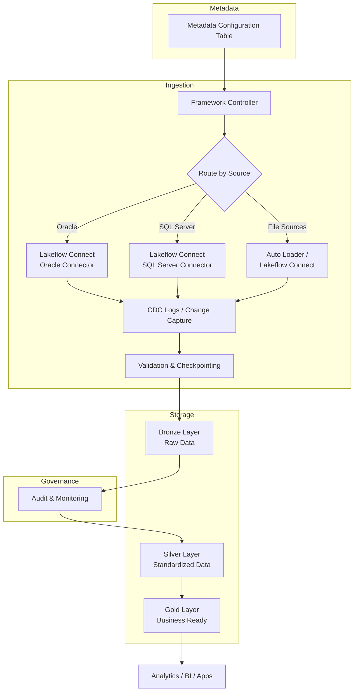
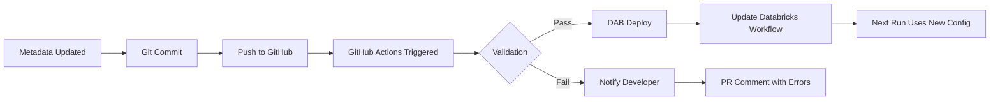
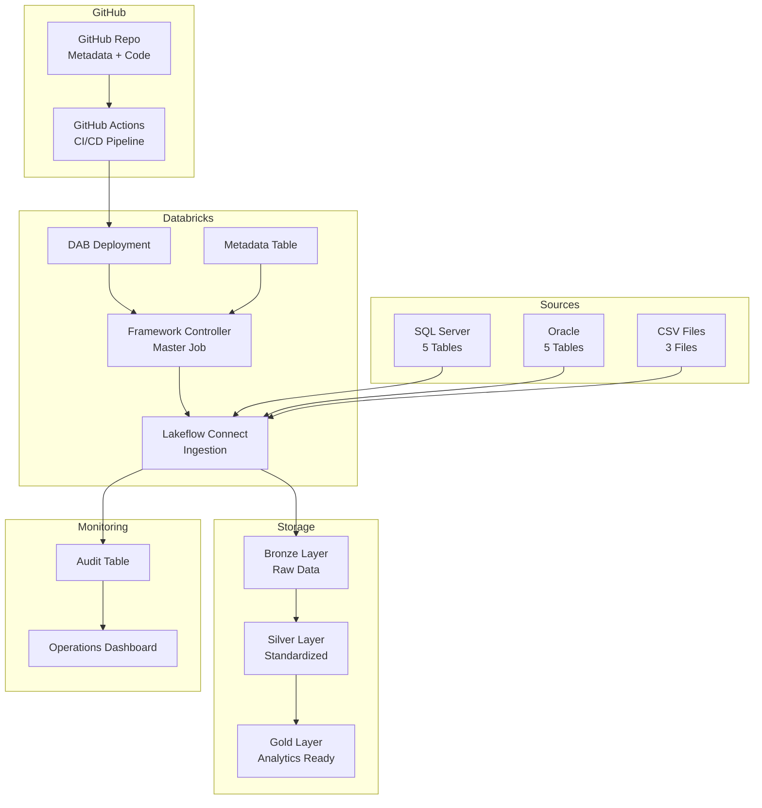

# Metadata-Driven Ingestion Architecture for Enterprise Scale

## Executive Summary

For enterprise platforms like Cuscal, the ingestion framework is **not built around individual tables**. Instead, it is built around **metadata-driven onboarding**.

**The core principle:**

> "How do we onboard the 101st table without writing new code?"

This is where **Lakeflow Connect + metadata + DAB** becomes powerful.

---

## The Problem: Traditional Approach (Doesn't Scale)

### Scenario: Enterprise Data Integration

Imagine an enterprise environment with:
- **20 source systems**
- **500 tables**
- **Daily loads**

### Traditional Approach

A developer creates one script per table:

```
customer_ingest.py
account_ingest.py
transaction_ingest.py
merchant_ingest.py
...
(500 scripts total)
```

### Problems with This Approach

| Problem | Impact |
|---------|--------|
| **High Maintenance Burden** | Every script is individually updated and tested |
| **Inconsistent Logic** | Different error handling, retry logic, logging across scripts |
| **Difficult Monitoring** | Need to monitor 500 separate jobs |
| **Slow Onboarding** | New table = new code + testing + deployment cycle |
| **Scaling Issues** | Adding more tables becomes exponentially harder |
| **Knowledge Silos** | Logic scattered across many notebooks and scripts |

This approach cannot scale beyond a certain number of tables.

---

## The Solution: Metadata-Driven Framework

### Core Concept

Instead of writing code for every table, create:

```
Generic Framework
       +
Metadata Configuration
       =
N Tables (100, 500, 1000+)
```

The framework **reads configuration** and **dynamically decides** what to ingest.

### High-Level Architecture



---

## Metadata-Driven Design

### Metadata Configuration Table

Instead of coding each table, maintain a **configuration table**:

```sql
-- metadata_ingestion_config

CREATE TABLE IF NOT EXISTS metadata_ingestion_config (
    config_id INT,
    source_system STRING,
    schema_name STRING,
    table_name STRING,
    load_type STRING,           -- CDC, FULL, INCREMENTAL
    active_flag STRING,         -- Y/N
    last_load_timestamp TIMESTAMP,
    created_at TIMESTAMP,
    updated_at TIMESTAMP
);
```

### Example Configuration

| source_system | schema | table_name | load_type | active_flag |
|---|---|---|---|---|
| Oracle | CUSTOMER | ACCOUNT | CDC | Y |
| Oracle | CUSTOMER | ADDRESS | CDC | Y |
| SQL Server | dbo | CUSTOMER | CDC | Y |
| SQL Server | dbo | TRANSACTION | CDC | Y |
| SharePoint | NA | CustomerFile | FULL | Y |
| S3 | NA | PartnerFeed | INCREMENTAL | Y |

This single metadata table could contain **500 rows** (or more).

**Each row = one onboarded table.**

---

## Daily Processing Flow

### Step 1: Framework Initialization

**Time: 2:00 AM (Daily Trigger)**

Master framework job starts.

```python
# Triggered by Databricks scheduler or GitHub Actions
# No table-specific code
# Pure metadata-driven execution
```

### Step 2: Read Metadata Configuration

Framework queries the metadata table:

```sql
SELECT *
FROM metadata_ingestion_config
WHERE active_flag = 'Y'
ORDER BY source_system, schema_name, table_name
```

**Returns:** 500 tables across all sources

### Step 3: Group Tables by Source System

Framework dynamically groups tables:

```
Oracle:        200 tables
SQL Server:    150 tables
SharePoint:    30 files
S3:            100 files
Azure Blob:    20 files
```

This determines which connector to use.

### Step 4: Create Ingestion Tasks Dynamically

For each source system group, the framework creates tasks:

```
Task 1: oracle.customer.account
Task 2: oracle.customer.customer
Task 3: oracle.customer.address
...
Task 200: oracle.*.* (all Oracle tables)

Task 201: sqlserver.dbo.customer
Task 202: sqlserver.dbo.transaction
...
Task 350: sqlserver.*.* (all SQL tables)

Task 351: sharepath.customers
...
```

**Key Point:** No new coding required. Configuration only.

---

## How Lakeflow Connect Fits

### For Oracle Sources

```
Oracle Database
       ↓
   CDC Logs
       ↓
Lakeflow Connect (Oracle Connector)
       ↓
   Change Capture (INSERT/UPDATE/DELETE)
       ↓
Bronze Delta Table
```

Lakeflow Connect handles:
- Secure connectivity to Oracle
- Schema discovery
- Incremental change data capture
- Parallel extraction
- Handling of large tables

### For SQL Server Sources

```
SQL Server Database
       ↓
   CDC Logs / Query Log
       ↓
Lakeflow Connect (SQL Server Connector)
       ↓
   Incremental Extraction
       ↓
Bronze Delta Table
```

### For File Sources

```
CSV / JSON / Parquet Files
       ↓
   Auto Loader / Lakeflow Connect
       ↓
   File Schema Inference
       ↓
Bronze Delta Table
```

Instead of writing extraction notebooks, **Lakeflow Connect handles**:
- Connectivity setup
- Incremental extraction
- Change capture logic
- Parallel ingestion
- Error handling and retries

---

## Handling Hundreds of Tables

### Sequential Processing (Bad)

Loading 500 tables sequentially:

```
Table 1 (10 min)
Table 2 (10 min)
Table 3 (10 min)
...
Table 500 (10 min)
```

**Total time: 83 hours** ❌

This is not practical for daily operations.

### Parallel Processing (Good)

Using Databricks Workflows, execute tasks concurrently:

```
Worker Pool 1:  50 tables in parallel
Worker Pool 2:  50 tables in parallel
Worker Pool 3:  50 tables in parallel
...
Worker Pool 10: 50 tables in parallel
```

**Total time: 10 minutes** ✅

Databricks Workflows automatically manages parallelization based on cluster capacity.

#### Example Parallel Execution Configuration

```yaml
# DAB jobs.yaml
jobs:
  - name: master_ingestion_framework
    tasks:
      - task_key: read_metadata
        spark_python_task:
          python_file: assets/read_metadata.py
      
      - task_key: process_oracle_tables
        depends_on:
          - task_key: read_metadata
        spark_python_task:
          python_file: assets/process_source.py
        parameters:
          source_system: "oracle"
      
      - task_key: process_sqlserver_tables
        depends_on:
          - task_key: read_metadata
        spark_python_task:
          python_file: assets/process_source.py
        parameters:
          source_system: "sqlserver"
      
      - task_key: process_files
        depends_on:
          - task_key: read_metadata
        spark_python_task:
          python_file: assets/process_source.py
        parameters:
          source_system: "file"
```

---

## Incremental Loading Strategy

### The Problem with Full Loads

Most enterprise tables do **NOT reload fully** every day.

Example:

```
Customer table:  10 million records
Yesterday:       500 records changed
Today:           Need to reload 500 records, not 10 million
```

**Cost impact:**
- Full load: 10M rows × compute cost = expensive
- Incremental: 500 rows × compute cost = cheap

### Solution: Change Data Capture (CDC)

Use CDC to capture only changes:

```
INSERT → New records
UPDATE → Modified records
DELETE → Removed records
```

### Watermark Strategy

Framework maintains an **audit table** to track load progress:

```sql
-- ingestion_audit table

CREATE TABLE ingestion_audit (
    source_system STRING,
    table_name STRING,
    last_load_timestamp TIMESTAMP,
    records_loaded INT,
    load_status STRING
);

-- Example data:
-- oracle    | account  | 2026-10-07 23:59:00 | 1200  | SUCCESS
-- oracle    | customer | 2026-10-07 23:59:00 | 500   | SUCCESS
-- sqlserver | transact | 2026-10-07 23:59:00 | 0     | SUCCESS
```

#### Next Ingestion Run

Query only new records:

```sql
SELECT *
FROM source_table
WHERE update_timestamp > last_load_timestamp
  AND update_timestamp <= current_timestamp
```

**Result:** Only changed records are ingested.

---

## Data Layering Strategy

### Bronze Layer (Raw)

Every source table lands **as-is**:

```
bronze.oracle.account
bronze.oracle.customer
bronze.sqlserver.transaction
bronze.sqlserver.customer
bronze.sharepoint.customers
```

**Characteristics:**
- No business logic applied
- Raw schema preserved
- Audit columns added:
  - `_ingestion_time`: When record was ingested
  - `_source_system`: System it came from
  - `_run_id`: Which run loaded it
  - `_is_deleted`: CDC delete flag (if applicable)

**Example Schema:**

```sql
CREATE TABLE bronze.oracle.account (
    ACCOUNT_ID INT,
    CUSTOMER_ID INT,
    ACCOUNT_TYPE STRING,
    BALANCE DECIMAL(15,2),
    CREATED_DATE DATE,
    -- Audit columns
    _ingestion_time TIMESTAMP,
    _source_system STRING,
    _run_id STRING,
    _is_deleted BOOLEAN
)
```

### Silver Layer (Standardized)

Standardization and cleansing occurs here.

**Problem:** Source systems have different naming:
- Oracle: `CUST_ID`, `ACCT_ID`
- SQL Server: `CustomerID`, `AccountID`
- SharePoint: `cust-id`, `acct-id`

**Solution in Silver:**

```sql
CREATE TABLE silver.customer_account (
    customer_id INT,
    account_id INT,
    account_type STRING,
    balance DECIMAL(15,2),
    created_date DATE,
    -- Audit columns
    _source_system STRING,
    _ingestion_date DATE,
    _last_updated TIMESTAMP
)
```

**Transformations applied:**
- Rename columns to standard names
- Type conversions
- Null handling
- Deduplication
- Validation rules

### Gold Layer (Business Ready)

Curated datasets for analytics:

```
gold.customer_360       -- 360-degree customer view
gold.account_summary    -- Account-level aggregations
gold.transaction_facts  -- Transaction fact table
gold.transaction_dim    -- Transaction dimension
```

**Characteristics:**
- Business logic applied
- Optimized for reporting
- Joined with reference data
- Ready for BI tools

---

## Monitoring and Governance Layer

### Ingestion Run Audit Table

Track every ingestion run:

```sql
CREATE TABLE ingestion_run_audit (
    run_id STRING,
    source_system STRING,
    table_name STRING,
    records_ingested INT,
    load_status STRING,
    start_time TIMESTAMP,
    end_time TIMESTAMP,
    duration_seconds INT,
    error_message STRING
);

-- Example:
-- run_123 | oracle    | account  | 25000 | SUCCESS | 2026-10-08 02:00 | 2026-10-08 02:05 | 300 | NULL
-- run_123 | sqlserver | customer | 1000  | SUCCESS | 2026-10-08 02:05 | 2026-10-08 02:06 | 60  | NULL
-- run_123 | oracle    | product  | 0     | FAILED  | 2026-10-08 02:07 | 2026-10-08 02:08 | 60  | "Connection timeout"
```

### Operational Dashboard

This audit data powers an operations dashboard:

```
Today's Ingestion Summary
├─ Total tables: 500
├─ Successful: 499
├─ Failed: 1
├─ Total records ingested: 1,234,567
├─ Total duration: 15 minutes
└─ Failed tables: oracle.product
```

---

## Error Handling and Resilience

### Failure Isolation

If one table fails, **do not cascade**:

```
Oracle.Account   → FAILED (network timeout)
Oracle.Customer  → SUCCESS
Oracle.Address   → SUCCESS
...
SQL Server.*     → SUCCESS
Files.*          → SUCCESS

Result: 499 SUCCESS, 1 FAILED
```

**Modern frameworks isolate failures** so that:
1. Other tables continue processing
2. Failed table can be retried independently
3. Operations team is alerted

### Retry Logic

Failed tables can be automatically retried:

```python
# Pseudo-code
for table in failed_tables:
    retry_count = 0
    while retry_count < 3 and not success:
        try:
            ingest(table)
            mark_as_success(table)
        except Exception as e:
            retry_count += 1
            log_error(table, e, retry_count)
            wait(exponential_backoff(retry_count))
```

### Alerting

Notify operations team of failures:

```
Email Alert:
Subject: Ingestion Framework Alert - oracle.product FAILED

Table: oracle.product
Status: FAILED
Error: Connection timeout to Oracle database
Retry attempt: 1 of 3
Last attempted: 2026-10-08 02:08:15
Action: Auto-retry scheduled for 02:15
Manual action required if auto-retries exhaust.
```

---

## Source Onboarding Process

### Traditional Approach (Old)

1. Developer writes custom code
2. Code review and testing
3. Deploy to production
4. Monitor
5. Update documentation

**Timeline:** 1-2 weeks per new table

### Modern Approach (New)

1. Add metadata row
2. Deploy metadata
3. Framework automatically ingests

**Timeline:** 5 minutes per new table

### Example: Onboarding a New Oracle Table

**Requirement:** Ingest LOYALTY_ACCOUNT table from Oracle CUSTOMER schema

**Step 1: Add metadata row**

```sql
INSERT INTO metadata_ingestion_config VALUES (
    config_id := 501,
    source_system := 'oracle',
    schema_name := 'CUSTOMER',
    table_name := 'LOYALTY_ACCOUNT',
    load_type := 'CDC',
    active_flag := 'Y',
    created_at := current_timestamp(),
    updated_at := current_timestamp()
);
```

Or as JSON:

```json
{
  "config_id": 501,
  "source_system": "oracle",
  "schema_name": "CUSTOMER",
  "table_name": "LOYALTY_ACCOUNT",
  "load_type": "CDC",
  "active_flag": "Y"
}
```

**Step 2: Commit to Git**

```bash
git add metadata_config.json
git commit -m "Add LOYALTY_ACCOUNT table to ingestion framework"
git push
```

**Step 3: GitHub Actions Deployment**

- GitHub Action detects commit
- Validates metadata
- Deploys via DAB to Databricks
- Framework is updated

**Step 4: Next scheduled run**

- Framework reads metadata
- Sees LOYALTY_ACCOUNT as active
- Automatically ingests via Lakeflow Connect
- No custom notebook required

**Done.** The new table is now being ingested.

---

## CI/CD with DAB + GitHub Actions

### Deployment Pipeline



### GitHub Actions Workflow

```yaml
name: Deploy Ingestion Metadata

on:
  push:
    branches: [ main ]
    paths:
      - 'config/metadata_ingestion_config.json'
  pull_request:
    branches: [ main ]

jobs:
  validate-and-deploy:
    runs-on: ubuntu-latest
    
    steps:
      - uses: actions/checkout@v4
      
      - name: Validate Metadata Schema
        run: |
          python scripts/validate_metadata.py \
            config/metadata_ingestion_config.json
      
      - name: Run Tests
        run: |
          pytest tests/ingestion_tests.py
      
      - name: Configure Databricks
        run: |
          databricks configure --token <<EOF
          ${{ secrets.DATABRICKS_HOST }}
          ${{ secrets.DATABRICKS_TOKEN }}
          EOF
      
      - name: Deploy DAB
        run: |
          dab deploy \
            --bundle lakeflow-ingestion-bundle \
            --target prod
      
      - name: Notify Success
        if: success()
        run: |
          echo "Ingestion framework deployed successfully"
          echo "New tables will be ingested on next scheduled run"
```

---

## Proposed Architecture for Cuscal POC

### Scope

Keep the POC practical and focused:

#### Source Systems
- **SQL Server** (operational databases)
- **Oracle** (enterprise applications)
- **CSV/File Sources** (flat file ingestion)

#### Key Capabilities to Demonstrate
1. **Metadata-driven onboarding** (core differentiator)
2. **Lakeflow Connect** ingestion from multiple sources
3. **Bronze layer** creation with audit columns
4. **Parallel processing** of multiple tables
5. **Incremental loading** with watermarks
6. **Error isolation** and retry logic
7. **Audit and monitoring** framework
8. **GitHub Actions** deployment automation
9. **DAB** deployment and job orchestration

### Architecture Diagram



### POC Implementation Steps

1. **Setup metadata table** with sample sources
2. **Create framework controller** that reads metadata
3. **Implement Lakeflow Connect** for SQL Server
4. **Implement Lakeflow Connect** for Oracle
5. **Implement file ingestion** for CSV
6. **Create bronze tables** with audit columns
7. **Add error handling** and retry logic
8. **Setup GitHub Actions** for deployment
9. **Create audit dashboard** for monitoring
10. **Demonstrate onboarding** of a new table without code changes

### Key Success Metrics

✅ Framework code never changes when onboarding a new table  
✅ New table onboarding takes < 30 minutes  
✅ Metadata-driven configuration proven with 3+ sources  
✅ Parallel processing demonstrated (multiple tables simultaneously)  
✅ Audit trail and monitoring in place  
✅ Error handling doesn't cascade failures  

---

## Key Message for Stakeholders

### The Breakthrough

> "The framework code never changes when onboarding a new table. Only metadata changes."

### What This Means

| Factor | Traditional | Metadata-Driven |
|--------|-------------|-----------------|
| **Time to onboard table** | 1-2 weeks | 30 minutes |
| **New code per table** | Yes (custom script) | No (metadata only) |
| **Scalability** | ~50 tables | 500+ tables |
| **Maintenance burden** | High | Low |
| **Monitoring complexity** | High | Low |
| **Developer time to add table** | Full day | 10 minutes |

### Why It Matters for Cuscal

1. **Scale**: 20 source systems, 500+ tables → 1 framework
2. **Speed**: New sources onboarded in days, not months
3. **Cost**: Reduced developer maintenance overhead
4. **Reliability**: Consistent error handling and logging
5. **Governance**: Centralized audit trail and monitoring
6. **Flexibility**: Easy to add new sources or transformation logic

---

## Summary

A metadata-driven ingestion framework powered by Lakeflow Connect, DAB, and GitHub Actions enables enterprise data platforms to scale efficiently. By separating configuration from code, organizations can onboard hundreds or thousands of tables without writing new ingestion logic, dramatically reducing time-to-value and maintenance burden.

This approach is ideal for enterprises like Cuscal that need to integrate data from multiple source systems while maintaining consistency, auditability, and operational efficiency.

